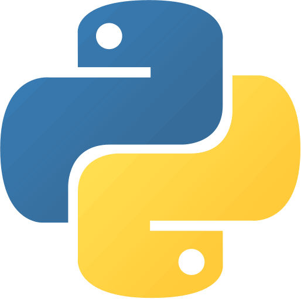
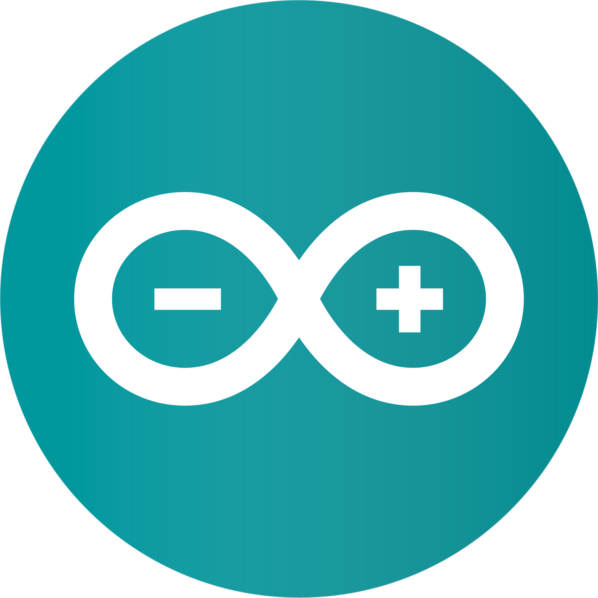

<table width="100%">
<tr>
<td width="55%" align="left" valign="middle">

<h1 align="center">
Hi, I'm RyuukDN
</h1>

<h3 align="center">
ソフトウェアエンジニア • 組込みシステム開発者 • 自動化エンジニア
</h3>

<h4 align="center" style="opacity: 0.8;">
Software Engineer • Embedded Systems Developer • Automation Enthusiast
</h4>

  <h3 align="center"><b>未知に学び、解を創る。</b></h3>
  <h4 align="center"><b>LEARNING THE NEW, BUILDING SOLUTIONS.</b></h4>

</td>
<td width="45%" align="center" valign="middle">

<!-- Anime coding animation from repository -->

</td>
</tr>
</table>

## 🛠️ 技術スタック & ツール / Tech Stack & Tools

  &nbsp;&nbsp;
  &nbsp;&nbsp;
  &nbsp;&nbsp;
  &nbsp;&nbsp;
  &nbsp;&nbsp;
  

###

  <h2>アカウント連携 / Connect with me</h2>
  
  [**GitHub Profile**](https://github.com)

